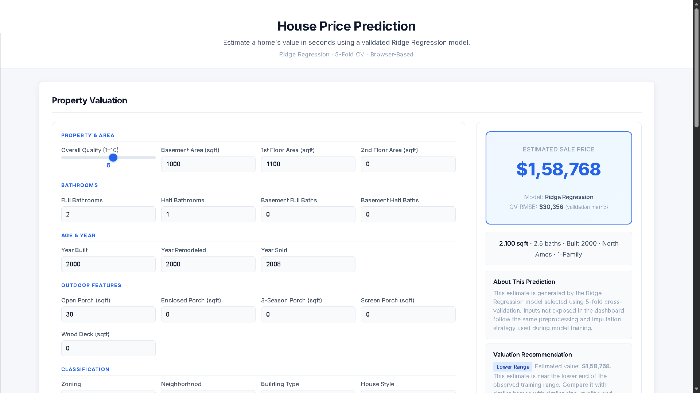

<div align="center">

### **House Price Prediction using Regression Models**

**ML-Powered Residential Property Valuation with Interactive Dashboard & In-Browser Inference**

[](LICENSE)
[]()
[]()
[]()
[]()
[]()
[]()
[]()
[]()
[]()
[]()

---

**House Price Prediction using Regression Models** is a portfolio-grade ML platform that predicts residential property sale prices using supervised regression on the Ames Housing Dataset (1,460 records, 79 predictors).
It achieves a **CV RMSE of $30,356** and **R² of 0.835** on the held-out test set (10/10 tests passing) while operating as a **serverless GitHub Pages deployment** with **zero-cost static hosting** and **100% in-browser inference**.

The dashboard features **4 preset demo scenarios** (Typical Home, Premium Home, Budget/Older, Large Home) for quick exploration, **Clear Inputs** for form reset, and **Reset Example** for deterministic example values.

[**Live Dashboard**](https://girishshenoy16.github.io/House-Price-Prediction-using-Regression-Models/) | [**Project Report**](reports/detailed_project_report.md) | [**Executive Summary**](reports/executive_summary.md)

</div>

---

## Live Demo

<div align="center">



ML-powered house price prediction with a **Power BI-inspired** 3-section dashboard. 100% static deployment on GitHub Pages. Zero data leaves the browser.

</div>

---

## 1. Business Problem

Real estate professionals and home buyers need accurate property valuations to make informed decisions. Manual appraisals are time-consuming and inconsistent, creating demand for data-driven automated valuation models.

This system predicts residential property sale prices from structural and categorical features, enabling data-driven real estate valuation through an interactive web dashboard that runs entirely in the browser.

## 2. Dataset

**Ames Housing Dataset** — 1,460 residential property records with 79 predictor features and one target variable (`SalePrice`).

| Split     | Samples   | Percentage |
|-----------|-----------|------------|
| Training  | 1,168     | 80.0%      |
| Holdout   | 292       | 20.0%      |
| **Total** | **1,460** | **100%**   |

**Feature Engineering:** 79 raw predictors + 6 engineered features = 283 encoded features (`Id` excluded as identifier)

### Engineered Features

| Feature          | Formula                                                              | Description           |
|------------------|----------------------------------------------------------------------|-----------------------|
| `TotalSF`        | `1stFlrSF + 2ndFlrSF + TotalBsmtSF`                                  | Total livable area    |
| `TotalBaths`     | `FullBath + 0.5×HalfBath + BsmtFullBath + 0.5×BsmtHalfBath`          | Total bathrooms       |
| `AgeAtSale`      | `YrSold - YearBuilt`                                                 | Age at transaction    |
| `RemodAgeAtSale` | `YrSold - YearRemodAdd`                                              | Time since remodel    |
| `QualAreaIndex`  | `OverallQual × TotalSF`                                              | Quality-weighted area |
| `TotalPorchSF`   | `OpenPorchSF + EnclosedPorch + 3SsnPorch + ScreenPorch + WoodDeckSF` | Total porch area      |

## 3. Model Results

### Cross-Validation Results (5-Fold)

| Model                   | CV RMSE     | CV MAE      | CV R²     |
|-------------------------|-------------|-------------|-----------|
| Linear Regression       | $31,109     | $16,619     | 0.832     |
| **Ridge Regression** ★ | **$30,356** | **$15,934** | **0.835** |
| Lasso Regression        | $31,877     | $15,848     | 0.810     |
| Random Forest           | $31,756     | $18,630     | 0.845     |
| XGBoost                 | $30,439     | $16,887     | 0.856     |

### Holdout Evaluation (Unseen 20%)

| Model                   | Holdout RMSE | Holdout MAE | Holdout R² |
|-------------------------|--------------|-------------|------------|
| Linear Regression       | $153,855     | $24,201     | -6.219     |
| Ridge Regression        | $126,840     | $19,853     | -2.593     |
| Lasso Regression        | $117,936     | $18,335     | -1.823     |
| **Random Forest**       | **$26,380**  | **$12,176** | **0.774**  |
| **XGBoost**             | **$22,387**  | **$12,465** | **0.887**  |

**Selected Deployment Model:** Ridge Regression — chosen by 5-fold cross-validation as the best predictive model with full browser-compatible reproducibility.

> **Note:** 
> XGBoost achieves the best holdout RMSE ($22,387) but the model is selected by CV performance, not holdout results. 
> The holdout set serves as an unseen benchmark to verify generalization, not as a selection criterion.

## 4. Dashboard

| Section              | Features                                                                                                                              |
|----------------------|---------------------------------------------------------------------------------------------------------------------------------------|
| **Predict Price**    | Interactive input form, inline validation, loading state, dynamic property summary, engineered feature display, extrapolation warning, valuation recommendation |
| **Try a Scenario**   | 4 preset scenarios (Typical Home, Premium Home, Budget/Older, Large Home) with "Scenario loaded" feedback                              |
| **Actions**          | Predict Price (primary), Clear Inputs (secondary), Reset Example (secondary)                                                          |
| **Model Comparison** | 5-model performance table with selected model badge, CV and holdout metrics                                                           |
| **Visualizations**   | Actual vs Predicted scatter (292 Ridge holdout points), Price vs Living Area with trend line, Top Ridge Feature Effects bar chart     |

### Data Integrity

All dashboard visualizations are driven by Python-generated data — no hardcoded values:

- Model comparison reads from `model_export.json`
- Scatter chart uses holdout predictions from `model_export.json`
- Price chart uses raw data sample from `model_export.json`
- Feature chart uses Ridge coefficients from `model_export.json`

## 5. Architecture

```
Ames Housing Dataset (1,460 records)
    ↓
Data Validation & Stratified Split (src/data_loader.py)
    ↓
6 Engineered Domain Features (src/feature_engineering.py)
    ↓
Leakage-safe Preprocessing (Pipeline + ColumnTransformer) (src/preprocessing.py)
    ↓
5 Regression Models × 5-Fold CV (src/model_trainer.py)
    ↓
80/20 Stratified Holdout Evaluation (src/evaluator.py)
    ↓
Selected Model → docs/model_export.json (src/json_exporter.py)
    ↓
Browser-side JavaScript Inference (docs/app.js)
    ↓
3-Section Power BI-style Dashboard (GitHub Pages)
```

### Key Design Decisions

- **Static deployment** via GitHub Pages (zero server required)
- **In-browser inference** — no API calls, no backend, full privacy
- **Deterministic preprocessing** — identical pipeline in Python and JavaScript
- **No data leakage** — preprocessing fitted only on training data
- **Two-stage model selection** — CV-based selection with 5% tolerance rule
- **Single canonical artifact** — `model_export.json` contains everything for browser inference

## 6. Python ↔ JavaScript Parity

| Check                      | Result                                              |
|----------------------------|-----------------------------------------------------|
| Canonical test cases       | 5 (lower, median, higher, missing-imputed, holdout) |
| Class-label agreement      | N/A (regression)                                    |
| Max prediction difference  | $0.00                                               |
| Parity tolerance           | 0.01% of prediction value                           |
| JS writes reference files  | No — Python is sole reference generator             |
| Prediction implementations | Parallel (Python pipeline + JS engine)              |

## 7. Testing & Quality

| Module               | Tests         | Status        |
|----------------------|---------------|---------------|
| test_pipeline.py     | 10            | ✅            |
| test_js_parity.py    | 5 cases       | ✅            |
| 15-point diagnostics | 15            | ✅            |
| **Total**            | **30 checks** | **100% pass** |

- 5/5 Python ↔ JavaScript parity tests pass ($0.00 difference)
- 15/15 diagnostic tests pass (split, leakage, reproducibility, export integrity)
- Zero data leakage verified by automated test
- Deterministic training verified (identical results with `random_state=42`)

## 8. Quick Start

```bash
# Clone the repository
git clone https://github.com/girishshenoy16/House-Price-Prediction-using-Regression-Models.git
cd House-Price-Prediction-using-Regression-Models

# Create and activate virtual environment
python -m venv venv
venv\Scripts\activate          # Windows
source venv/bin/activate       # Linux/Mac

# Install dependencies
pip install --upgrade pip
pip install -r requirements.txt

# Run complete pipeline (trains models, exports artifacts, generates charts)
python main.py

# Run tests
python -m pytest tests/ -v

# Run parity test
python tests/test_js_parity.py

# Start dashboard server
python -m http.server 8000 --directory docs

# Open http://localhost:8000
```

## Folder Structure

```
House Price Prediction using Regression Models/
├── data/
│   ├── raw/                              # Immutable Ames Housing Dataset
│   └── processed/                        # Processed train/holdout splits & engineered features
├── src/
│   ├── __init__.py
│   ├── data_loader.py                    # Data integrity validator & stratified split
│   ├── feature_engineering.py            # 6 frozen domain features
│   ├── preprocessing.py                  # Leakage-safe Imputation, One-Hot Encoding & StandardScaler
│   ├── model_trainer.py                  # Trains 5 models with 5-fold CV (seed=42)
│   ├── evaluator.py                      # Holdout evaluation & model selection
│   ├── json_exporter.py                  # Serializes model weights to docs/model_export.json
│   ├── visualizer.py                     # Static chart generation
│   └── diagnostics.py                    # 15-point validation & diagnostics
├── models/
├── tests/
│   ├── test_pipeline.py                  # Unit tests (10 tests)
│   └── test_js_parity.py                 # 5-case Python ↔ JS parity suite
├── docs/
│   ├── index.html                        # Single-page dashboard
│   ├── style.css                         # Power BI-inspired theme
│   ├── app.js                            # Client-side JS inference engine
│   ├── model_export.json                 # Authoritative browser model artifact
│   └── .nojekyll                         # GitHub Pages config
├── logs/
├── models/
├── outputs/
│   ├── model_comparison.json             # Performance benchmarks
│   ├── holdout_predictions.csv           # Internal holdout predictions
│   └── plots/                            # Static PNG charts
├── reports/
│   ├── detailed_project_report.md        # Technical methodology & results
│   └── executive_summary.md              # High-level executive summary
├── main.py                               # Pipeline CLI entrypoint
├── requirements.txt                      # Python dependencies
├── .gitignore
└── README.md
```

## 9. Tech Stack

| Layer      | Technologies                                                           |
|------------|------------------------------------------------------------------------|
| ML         | scikit-learn (Ridge, Lasso, Linear Regression, Random Forest), XGBoost |
| Frontend   | HTML5, CSS3, Vanilla JS (ES6+), Chart.js 4.4.0                         |
| Testing    | pytest (10 tests), custom parity validator, 15-point diagnostics       |
| Deployment | GitHub Pages (100% static)                                             |

## 10. Limitations & Future Scope

**Limitations:**
- Ridge regression shows degraded holdout performance due to linear model constraints
- Feature count (283) relative to sample size (1,168 training) creates potential overfitting risk
- Ames Housing Dataset is a static benchmark — no real-time data integration
- Browser inference uses fixed imputation defaults for non-editable features

**Future Scope:**
- Ensemble stacking of Ridge + XGBoost for improved generalization
- Hyperparameter tuning (GridSearchCV / Optuna)
- Additional feature engineering (interaction terms, polynomial features)
- SHAP-based model explainability layer
- Real-time MLS data integration API

---

## Contact

<div align="center">

**Girish Shenoy**

[](https://github.com/girishshenoy16)
[](https://linkedin.com/in/girishshenoys)
[](mailto:girishpshenoy09@gmail.com)

</div>

---

## License

This project is licensed under the MIT License — see the [LICENSE](LICENSE) file for details.

---

## Acknowledgements

| Resource                                                                                     | Description                                |
|----------------------------------------------------------------------------------------------|--------------------------------------------|
| [Ames Housing Dataset](https://www.kaggle.com/c/house-prices-advanced-regression-techniques) | Kaggle competition dataset by Dean De Cock |
| [Scikit-learn](https://scikit-learn.org/)                                                    | Machine learning in Python                 |
| [XGBoost](https://xgboost.readthedocs.io/)                                                   | Gradient boosting framework                |
| [Chart.js](https://www.chartjs.org/)                                                         | JavaScript charting library                |

---

<div align="center">

**Built with precision. Designed for real estate analytics. Documented for portfolio presentation.**

House Price Prediction using Regression Models v1.0 — Portfolio-Grade ML Pipeline & Interactive Dashboard

</div>
